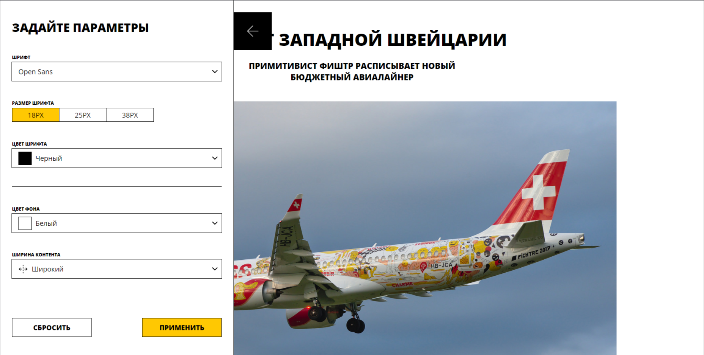

# Проектная работа: Вёрстка проекта

## «Blog-customizer» — это проект, созданный на React, в котором мы применяем знания, полученные в текущем спринте. Мы активно работаем с состояниями и эффектами.

Приложение предлагает уникальную возможность кастомизировать страницу блога через удобную панель настроек. В этой панели вы можете выбрать:

- шрифт текста;
- размер шрифта;
- цвет шрифта;
- цвет фона;
- ширину контента.

## Обзор проекта

Превью вёрстки проекта

Превью функциональности проекта

## Установка и запуск:

Для запуска Storybook выполните:

`npm run storybook`

Для запуска линтера для стилей выполните:

`npm run stylelint`

Для запуска линтера выполните:

`npm run lint`

Для запуска форматтера выполните:

`npm run format`

Для запуск Development сервера выполните:

`npm run start`

## Ссылка на <a href="https://github.com/PavelZavritskiy/blog-customizer" target="_blank">репозиторий</a>

## Автор: Заврицкий Павел

  
  

